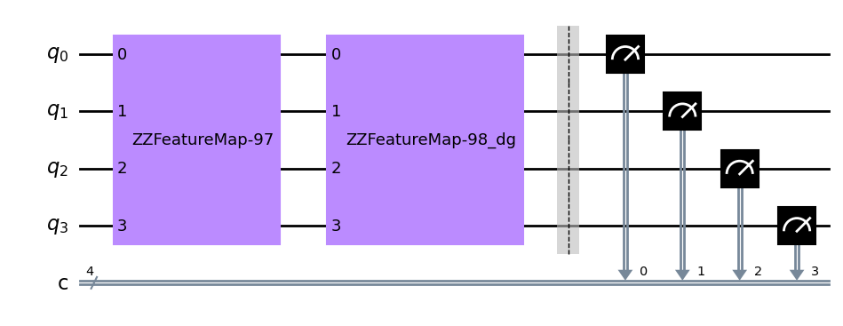

# QOSF Cohort 7 Screening Tasks
## Task 3: QSVM
Generate a Quantum Support Vector Machine (QSVM) using the iris dataset and try to propose a kernel from a parametric quantum circuit to classify the three classes(setosa, versicolor, virginica) using the one-vs-all format, the kernel only works as binary classification. Identify the proposal with the lowest number of qubits and depth to obtain higher accuracy. You can use the UU† format or using the Swap-Test.

